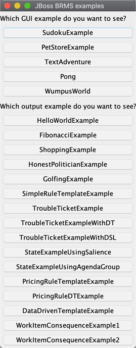

# Drools Examples
- This is an extract of the Official Drools samples from 
https://github.com/kiegroup/drools/tree/r7.41.0.Final/drools-examples
- The current version of Drools used in the sample is `v7.41.0.Final`

## Run
- Execute `org.drools.examples.DroolsExamplesApp` to open the GUI. 
- Use the GUI to run each sample


## GUI for Drools Examples



### Sample Log for Hello World Example
```$xslt
==>[ObjectInsertedEventImpl: getFactHandle()=[fact 0:1:1096463474:1096463474:1:DEFAULT:NON_TRAIT:org.drools.examples.helloworld.HelloWorldExample$Message:org.drools.examples.helloworld.HelloWorldExample$Message@415ab472], getObject()=org.drools.examples.helloworld.HelloWorldExample$Message@415ab472, getKnowledgeRuntime()=KieSession[1], getPropagationContext()=PhreakPropagationContext [entryPoint=EntryPoint::DEFAULT, factHandle=[fact 0:1:1096463474:1096463474:1:DEFAULT:NON_TRAIT:org.drools.examples.helloworld.HelloWorldExample$Message:org.drools.examples.helloworld.HelloWorldExample$Message@415ab472], originOffset=-1, propagationNumber=2, rule=null, type=INSERTION]]
==>[ActivationCreatedEvent: getActivation()=[[ Hello World active=false ] [ [fact 0:1:1096463474:1096463474:1:DEFAULT:NON_TRAIT:org.drools.examples.helloworld.HelloWorldExample$Message:org.drools.examples.helloworld.HelloWorldExample$Message@415ab472] ] ], getKnowledgeRuntime()=KieSession[1]]
==>[BeforeActivationFiredEvent:  getActivation()=[[ Hello World active=false ] [ [fact 0:1:1096463474:1096463474:1:DEFAULT:NON_TRAIT:org.drools.examples.helloworld.HelloWorldExample$Message:org.drools.examples.helloworld.HelloWorldExample$Message@415ab472] ] ], getKnowledgeRuntime()=KieSession[1]]
==>[ObjectUpdatedEventImpl: getFactHandle()=[fact 0:1:1096463474:1096463474:2:DEFAULT:NON_TRAIT:org.drools.examples.helloworld.HelloWorldExample$Message:org.drools.examples.helloworld.HelloWorldExample$Message@415ab472], getObject()=org.drools.examples.helloworld.HelloWorldExample$Message@415ab472, getOldObject()=org.drools.examples.helloworld.HelloWorldExample$Message@415ab472, getKnowledgeRuntime()=KieSession[1], getPropagationContext()=PhreakPropagationContext [entryPoint=EntryPoint::DEFAULT, factHandle=[fact 0:1:1096463474:1096463474:2:DEFAULT:NON_TRAIT:org.drools.examples.helloworld.HelloWorldExample$Message:org.drools.examples.helloworld.HelloWorldExample$Message@415ab472], originOffset=-1, propagationNumber=3, rule=[Rule name=Hello World, agendaGroup=MAIN, salience=0, no-loop=false], type=MODIFICATION]]
==>[AfterActivationFiredEvent: getActivation()=[[ Hello World active=false ] [ [fact 0:1:1096463474:1096463474:2:DEFAULT:NON_TRAIT:org.drools.examples.helloworld.HelloWorldExample$Message:org.drools.examples.helloworld.HelloWorldExample$Message@415ab472] ] ], getKnowledgeRuntime()=KieSession[1]]
==>[ActivationCreatedEvent: getActivation()=[[ Good Bye active=false ] [ [fact 0:1:1096463474:1096463474:2:DEFAULT:NON_TRAIT:org.drools.examples.helloworld.HelloWorldExample$Message:org.drools.examples.helloworld.HelloWorldExample$Message@415ab472] ] ], getKnowledgeRuntime()=KieSession[1]]
==>[BeforeActivationFiredEvent:  getActivation()=[[ Good Bye active=false ] [ [fact 0:1:1096463474:1096463474:2:DEFAULT:NON_TRAIT:org.drools.examples.helloworld.HelloWorldExample$Message:org.drools.examples.helloworld.HelloWorldExample$Message@415ab472] ] ], getKnowledgeRuntime()=KieSession[1]]
==>[AfterActivationFiredEvent: getActivation()=[[ Good Bye active=false ] [ [fact 0:1:1096463474:1096463474:2:DEFAULT:NON_TRAIT:org.drools.examples.helloworld.HelloWorldExample$Message:org.drools.examples.helloworld.HelloWorldExample$Message@415ab472] ] ], getKnowledgeRuntime()=KieSession[1]]
Hello World
Goodbye cruel world
```